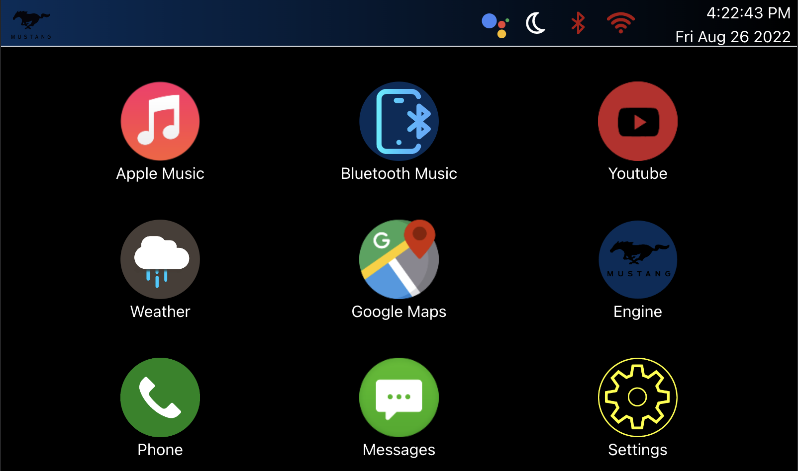

# Car Stereo

Car Stereo replaces your old radio unit with a modern touch screen Raspberry Pi with:

<ul>
<li>Apple Music</li>
<li>Bluetooth Media Playback</li>
<li>YouTube</li>
<li>Google Maps</li>
<li>OBDII Engine Data</li>
<li>Phone Calls - Incomplete</li>
<li>Messages - Incomplete</li>
</ul>

## Preview

## Installation

### Requirements:

Designed for Raspberry Pi Official Touch Screen Resolution 800x480

1. NodeJS Version 12.22.111
2. Keys.js File (Will Run with blank template file below) 
   a. Create a folder named 'private' within src/ 
   b. `mkdir src/private` 
   c. `nano src/private/keys.js` 
   d. Paste Keys JS File Below 

<code> module.exports = {
YouTubeAPIKey: "",
AppleMusicAPIKey:"",
GoogleMapsAPIKey: "",
WeatherAPIKey: "",
WifiName: "",
WifiPassword: "",
BluetoothMAC: "",
};
</code>

### Optional Requirements:

<ul>
<li><a href="https://developers.google.com/youtube/v3/getting-started">YouTube API Key</a></li>
<li><a href="https://developer.apple.com/" >Apple Music API Key </a></li>
<li><a href="https://developers.google.com/maps/documentation/javascript/get-api-key" >Google Maps API Key </a></li>
<li><a href="https://openweathermap.org/api"> Weather API Key</a></li>
<li><a href="https://www.amazon.com/dp/B01HXGX8V6?ref=nb_sb_ss_w_as-reorder-t1_ypp_rep_k1_1_15&amp&crid=1I2UE3SEXKP1Z&amp&sprefix=obdii+bluetooth"> OBDII Adapter </a></li>
<li>Raspberry Pi</li>
<li>Raspberry Pi Official Touchscreen</li>
</ul>

### Start:

`npm i` 
`npm run dev`
